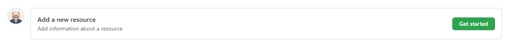
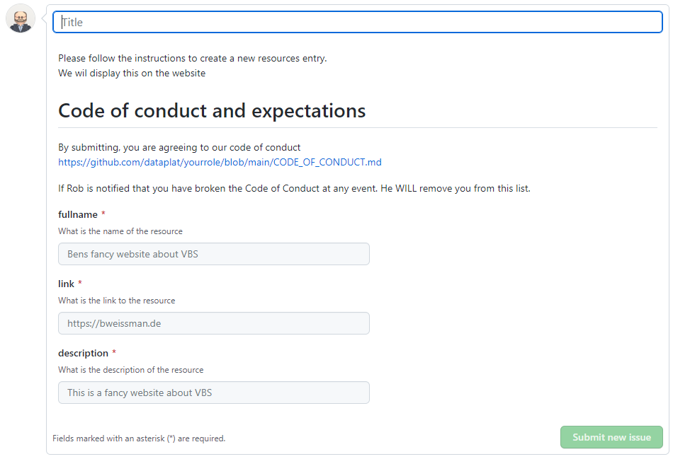

# A list of Resources to help being a more non-passive community member
A simple repository to serve as a resource for friends from the data platform community so they can find opportunities and inspirations to be more active community members. 

Rob Sewell and Ben Weissman
@SQLDBAWithABeard @bweissman

# Code of conduct and expectations

By submitting, you are agreeing to [our code of conduct](https://raw.githubusercontent.com/dataplat/yourrole/main/CODE_OF_CONDUCT.md)
       
If Rob or Ben are is notified that you have broken the Code of Conduct at any event. **We WILL remove your resources from this list**.

If you see a speaker that you know has broken the Code of Conduct at an event. Please let us know. You can find methods to contact us here https://robsewell.com / https://bweissman.de

This might seem extreme to some people for a simple little list of people, but it is important and we mean it. If you are thinking in this way then we suggest that you please go and listen and read and understand the reasons why. You are welcome to contact us for places to do this

## To add your resources/links

This process is all automated and driven by GitHub Issues  

Open the [Issues Page](https://github.com/dataplat/yourrole/issues) in this repository and click new issue

Click the get started button next to Add a new resource

Fill in the details, the title can be anything that you like

- A name/title for your resource
- A link 
- A description what to expect at that resource

Thats it, then press Submit new issue and the automation will do its thing

## To remove your resource

Delete your resourcename.md file and ask for the website workflow to be run
## To edit your speaker information

Either delete your speaker resourcename.md file and then add a new issue or edit your speaker resourcename.md file and ask for the website workflow to be run

# How it works

When an issue is created the on-issue GitHub Action is automatically triggered. This

- says thank you on the issue
- saves the issue form results to a file temporarily
- parses the temporary file and creates a speaker json file and saves it
- adds a comment to the issue and commits the change to the repo
- runs the websiteFile workflow which 
    - takes all the speaker json files and creates a new speaker-list.json which feeds the web-site
    - comments on the issue
    - commits all the changes and pushes them
- closes the issue
